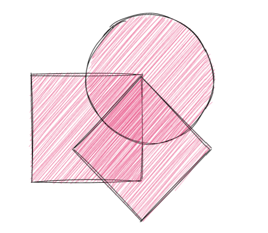
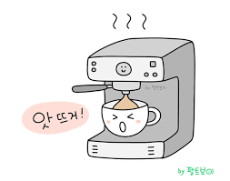

최근에 프로젝트를 진행하면서 간단하게 추상클래스를 생성해서 사용해봤는데, 팀원분이 추상메서드도 없고 추상변수도 없는데 어째서 추상클래스를 사용했냐라고 물어보셨는데 정확하게 대답이 나오지 않아서 이 기회에 한 번 정리하고자 합니다.

# 추상이란?

보통 “추상적”이란 표현은 딱 짚어서 말할 수 없는 어떠한 “개념”이나 모호하여 쉽게 정의할 수 없는 것을 떠올리게 됩니다.

OOP에서도 “추상”은 “개념”을 의미합니다.  
 “추상”은 객체가 가진 **복잡한 내부 구현을 숨기고 필요한 정보와 기능만 제공**하는 것입니다.
이렇게 함으로써 사용자가 객체를 쉽게 사용할 수 있도록 인터페이스를 제공하고 세부적인 로직은 감춥니다.



예를 들어, 커피 머신이라는 객체가 있다면 사용자는 커피 머신이 어떻게 작동하는지 알 필요 없이 버튼만 누르면 커피가 나오도록 만들 수 있습니다. 이렇게 함으로써 사용자는 복잡한 세부사항을 신경 쓰지 않고 간단하게 객체를 사용할 수 있습니다

# 추상클래스란?

> Abstract Class : 인스턴스화 할 수 없으며, 여러 파생 클래스에서 공통적으로 사용할 수 있는 필드와 메서드를 정의하는 것

추상클래스를 사용하는 예시로는 도형이라는 개념을 생각해 볼 수 있습니다.



도형이라는 클래스는 넓이나 둘레와 같은 공통된 필드와 메소드를 가질 수 있지만, 구체적인 형태나 계산 방법은 서브클래스에 따라 다르기 때문에 객체로 생성할 수 없습니다. 따라서 도형 클래스를 추상클래스로 선언하고, 넓이나 둘레를 구하는 메소드를 추상메소드로 정의한 후, 사각형이나 원과 같은 서브클래스에서 이를 구체화할 수 있습니다.

## 특징

> 추상 클래스는 미완성 설계도와 같은 역할을 하며, 추상 메서드를 선언할 수 있습니다.

- 메서드의 **선언만 있고** **구현이 없는** 메서드
- **상속 받을 경우** 추상 메서드를 **반드시 구헌**해야 한다
- 필드와 메서드를 가지지만 body는 가지지 않는다

일련의 특징으로 인해 추상 클래스는 상속 계층 구조에서 상위 클래스로서의 역할을 맡고 있습니다.

## 왜

> 추상클래스는 공통된 로직과 필드를 재사용하고 확장성을 높이기 위해 사용됩니다.

- **공통된 로직과 필드를 재사용하고 확장성을 높이기 위해**
- 서브클래스가 구현해야 하는 **메소드의 규약을 정의**하기 위해
- 객체의 **내부 구현을 숨기고 필요한 기능만 외부에 제공**하기 위해

## 어떻게

- 추상클래스는 abstract 키워드로 선언되며, 객체 생성이 불가능
- 추상클래스는 일반적인 메소드와 필드뿐만 아니라 추상메소드도 가질 수 있다.
- 추상메소드는 abstract 키워드로 선언되며, 바디가 없습니다.
- 서브클래스에서는 추상메소드를 오버라이딩하여 구체적인 구현을 제공해야 한다.

아래는 추상클래스, 메소드 선언 예제입니다.

```java
// 동물이라는 추상클래스
public abstract class Animal {
  // 울음소리를 나타내는 추상메소드
  public abstract void makeSound();
}
```

이렇게 선언된 추상메소드는 서브클래스에서 반드시 오버라이딩해야 합니다. 예를 들어, 고양이와 개라는 서브클래스에서 각각의 울음소리를 구현할 수 있습니다.

```java
// 고양이라는 서브클래스
public class Cat extends Animal {
  // 울음소리 메소드를 오버라이딩하여 구현
  public void makeSound() {
    System.out.println("Meow");
  }
}

// 개라는 서브클래스
public class Dog extends Animal {
  // 울음소리 메소드를 오버라이딩하여 구현
  public void makeSound() {
    System.out.println("Woof");
  }
}
```

이렇게 하면 다형성을 통해 동물 타입의 변수에 고양이나 개 객체를 할당하고, 각각의 울음소리 메소드를 호출할 수 있습니다.

```java
// 다형성을 통해 동물 타입의 변수에 고양이나 개 객체 할당
Animal cat = new Cat();
Animal dog = new Dog();

// 각각의 울음소리 메소드 호출
cat.makeSound(); // Meow 출력
dog.makeSound(); // Woof 출력
```

## 장점

- 공통된 메서드와 필드를 한 곳에서 관리하고 재사용할 수 있다
- 서브클래스가 반드시 구현해야 하는 메소드의 규약을 정의할 수 있다
- 다형성을 통해 유연하고 확장 가능한 코드를 작성할 수 있다

## 단점

- 객체 생성이 불가능하여 인스턴스 변수나 메소드에 직접 접근할 수 없다
- 단일 상속만 가능하여 다른 클래스와의 상속 관계가 제한된다
- 설계가 복잡해지고 오버라이딩 비용이 증가할 수 있다
