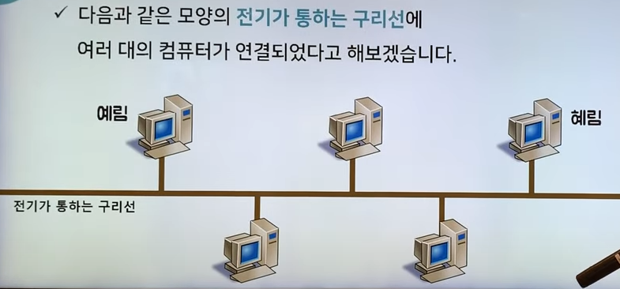
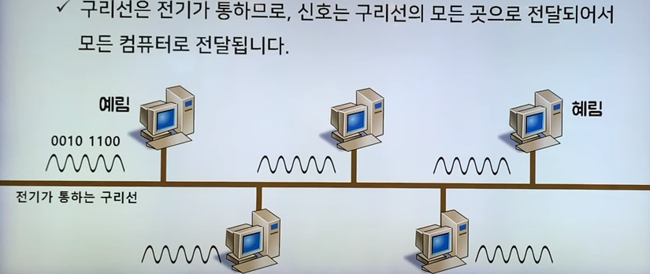
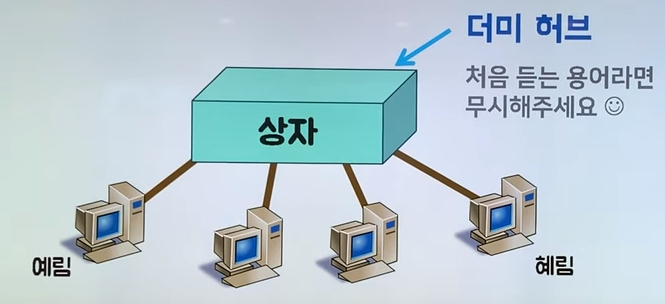
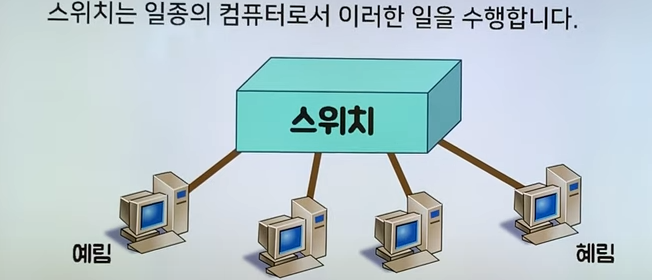
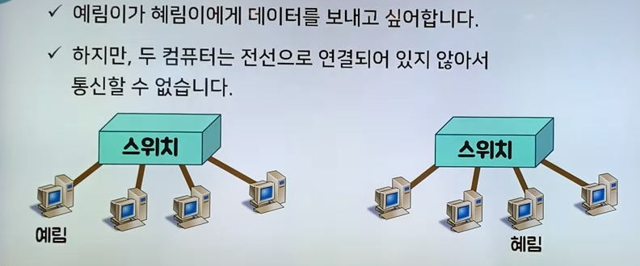
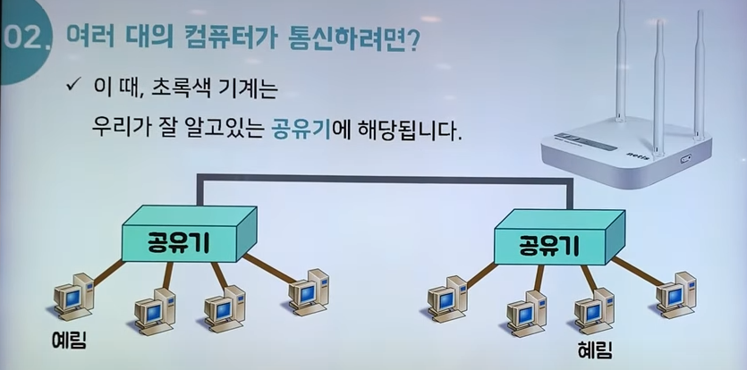
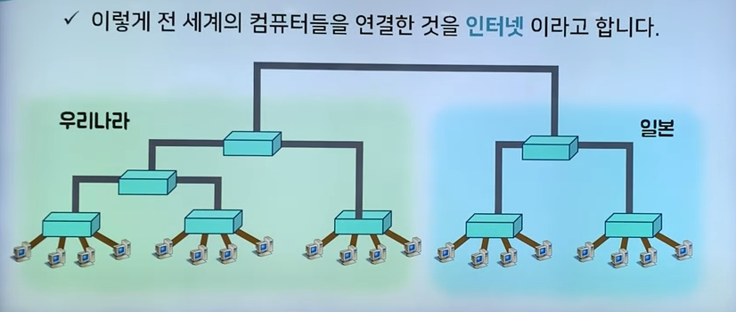
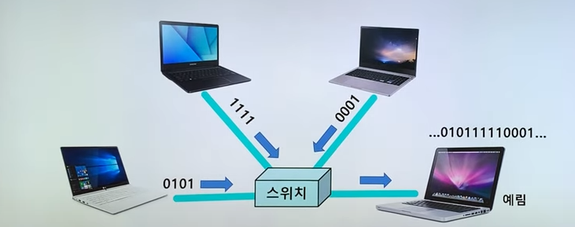

# 네트워크 - OSI 7계층

우리가 평소에 사용하는 인터넷은, 이 OSI 7계층, 7개의 단계를 통해 원활하게 사용할 수 있는 것이다.

해당 글은 우아한 테크 [[10분 테코톡] 🔮 히히의 OSI 7 Layer](https://www.youtube.com/watch?v=1pfTxp25MA8) 를 정리한 글입니다

# Physical Layer

Physical Layer는 컴퓨터와 컴퓨터가 연결되어 있을 때(전선 혹은 와이파이) 교환되는 디지털 신호를 말한다.

컴퓨터는 0과 1로 이루어져 있다.
두 대의 컴퓨터가 통신하기 위해서 보내야 하는 데이터는 **0과 1로 이루어진 신호를 전선으로 보내면 된다!**

하지만 실제로는 조금 더 복잡했다.

전선으로 보낼 수 있는 신호는 전자기파라고 하고 이를 통해 0과 1을 보낼 수 있다
그런데 일반적으로 사용하는 전선과 컴퓨터가 받아야할 신호의 괴리 때문에 이는 불가능하고
**아날로그 신호**로 바꾸서 전송해야 한다.

## 정리
- 0과 1의 나열을 아날로그 신호로 바꾸어 전선으로 흘려 보낸다(encoding)
- 아날로그 신호가 들어오면 0과 1의 나열롷 **해석(decoding)**
- 물리적으로 연결된 두 대의 컴퓨터가 0과 1의 나열을 주고받을 수 있게 해주는 모듈(module)
- 이러한 작업들이 PHY 칩을 통한 하드웨어로 구현되어 있다
# Data-Link Layer

MAC 주소는 모든 컴퓨터에 있는 LAN 카드의 주소를 의미하고, 이 주소를 통해 특정 컴퓨터를 찾아갈 수 있다.

A와 B가 있을 때 서로 전선으로 연결되어 있기 때문에 데이터를 주고 받을 수 있습니다

하지만 여기서 C가 나타나 A가 C에게도 데이터를 보내고 싶을 때는 어떻게 해야할까요?

A가 C와도 전선을 연결해야할까요?

이 방식은 매우 비효율적입니다. 통신하고자 하는 컴퓨터가 늘어날 때마다 계속해서 모든 컴퓨터와 서로서로 전선을 연결해야 하기 때문입니다

그래서 우리는 효율을 위해 전선 하나를 가지고 더 나은 방법을 모색합니다 

위와 같은 상황이 있을 때 예림이가 혜림이에게 **0010 0100** 이라는 데이터를
보내고 싶어졌습니다.

그래서 예림이의 컴퓨터는 0010 0100 에 해당하는 전자기파를 구리선으로 흘려 보냅니다

하지만 예림이의 컴퓨터와 연결된 모든 전선은 전부 전기가 통하기 때문에 모든 컴퓨터에 전달 됩니다

예림이는 혜림이한테 데이터를 보내고 싶었으니 결과적으론 잘 전달 되었네요

그럼 이제 연결된 모든 전선을 잘 정리해서 하나의 박스에 넣어볼게요

이제 이 네 대의 컴퓨터는 모두 상자안에 전선과 연결되어 있기 때문에
통신이 가능해졌습니다

하지만 여전히 예림이가 혜림이에게 데이터를 보내려고 하면   
나머지 다른 두 대의 컴퓨터도 그 메세지를 읽을 수 있습니다

이 상자를 통해 데이터가 전송되니까 이 상자가 **메시지의 목적지를 확인**해서 **원하는 대상에게만 줄 수 있다면** 어떨까요?

이러한 일을 수행하는 것이 바로 **"스위치"** 입니다
# Network Layer
IP 주소가 결정되는 계층으로, IPv4와 IPv6든 IP가 컴퓨터에 할당되면 전체 지구의 네트워크에서 우리 집의 네트워크 주소가 결정되었다는 것이다.

이 Layer에서 데이터 전송이 실패한 것은, 컴퓨터가 네트워크를 할당받지 못했다는 의미이다.

서로 다른 네트워크 두 개가 구축되어 있을 때,

예림이가 혜림이에게 데이터를 보내고 싶어 합니다.

하지만 두 컴퓨터는 전선으로 연결되어 있지 않아서 통신할 수 없습니다

그런데 만약 스위치와 스위치를 연결할 수 있다면 어떨까요

이러한 고민을 해결해줄 수 있는 **서로 다른 네트워크에 속한 컴퓨터끼리 통신이 가능하게 해주는 장비를 "라우터"** 라고 합니다

> 엄밀히 따지면 스위치 + 라우터 인 L3 스위치이지만, 이해를 돕기 위한 가정이라고 생각해주세요😊

이렇게 전선이 연결되어 있으니 예림이와 혜림이는 통신할 수 있을 것입니다

이렇게 전세계의 컴퓨터들을 연결한 것을 인터넷이라고 합니다
많은 컴퓨터가 연결되었으니 최상위 전선은 규모가 아주 큽니다

스위치를 통해 여러대의 컴퓨터가 연결되어 있을 때 거의 동시에 3대의 컴퓨터가 예림이에게 데이터를 보내면

예림이는 혼합된 상태의 데이터를 받게 됩니다

이거를 어떻게 끊어 읽는 지에 따라서 올바르게 데이터를 얻을 지 엉뚱한 데이터를 얻을 지 결정되겠죠?

그렇다면 어떻게 해야 제대로 끊어 읽을 수 있을까요?

# Transport Layer
TCP/UDP 가 결정되는 계층이다

이 Layer에서 실패한 것은, TCP handShake가 실패했거나 checksum 검증이 실패했다는 소리입니다. 데이터 전송이 불안정해져, 데이터 오염, 잘못된 값 전송, 값 전송 체크

# Session Layer

포트를 열고 세션을 유지하는 계층입니다.
실제로 현대 인터넷에서 사용하고 있지 않는 계층입니다.

# Presentation Layer

Application Layer를 위해 데이터를 유지하거나 암호화하는 계층
실제 현대 인터넷에서 사용하고 있지 않은 계층

# Application Layer

소프트웨어가 알아들을 수 있는 HTTP, FTTP, WS 등으로 해석해주는 계층
이 Layer에서 데이터 전송이 실패했다는 것은, HTTP나 FTP 등의 프로토콜이 잘못 해석되었다는 뜻이다.
