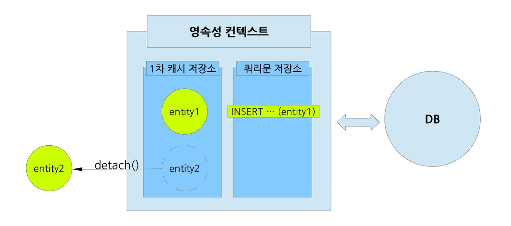
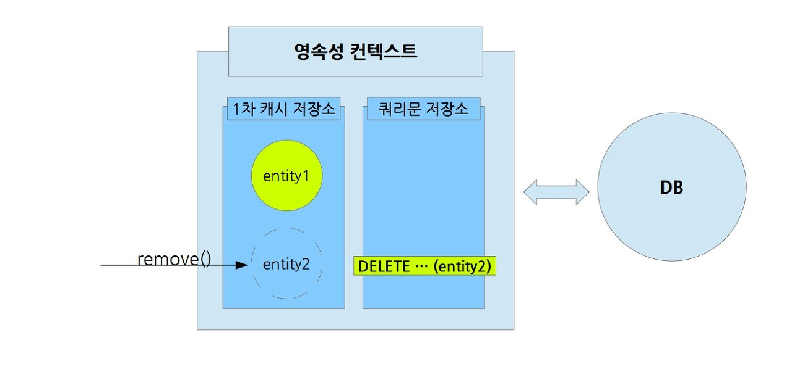

# 영속성 (Persistence)

# 영속성 컨텍스트  (Persistence Context

- 영속성 컨텍스트 : ``인스턴스로 존재하는 엔티티를 관리하고 영속화시키는 논리적 영역``
- 영속화의 사전적 의미는 '사라지지 않고 지속되게 한다'입니다. 쉽게 말하면 DB에 저장된다는 의미입니다.

``하지만 '영속'이라는 말에 현혹되면 안됩니다. 영속성 컨텍스트에서 관리하는 엔티티라고 해도 반드시 '영속화'되어 DB에 저장된 것은 아닙니다.`` 

다만 영속화 될 수 있는 가능성이 있을 뿐입니다.

## 엔티티의 생명주기 (Entity LifeCycle)

- **비영속(new/transient)**
    - 영속성 컨텍스트와 전혀 관계가 없는 상태
    - 객체를 생성'만' 한 상태 (순수한 객체 상태)
- **영속(managed)**
    - 영속성 컨텍스트에 저장된 상태
    - Entity가 영속성 컨텍스트에 의해 관리되는 상태
    - 영속 상태가 된다고 바로 DB에 쿼리가 날라가지 않는다.(DB 저장 X)
    - 트랜잭션의 commit 시점에 영속성 컨텍스트에 있는 정보들이 DB에 쿼리로 날아간다
- **준영속**(detached)
    - 영속성 컨텍스트에 저장되었다가 분리된 상태
    - 영속성 컨텍스트에서 지운 상태
    - ``entityManager.detach(member);``
- **삭제(removed)**
    - 실제 DB 삭제를 요청한 상태
    - ``entityManager.remove(member);``

*영속성 컨텍스트는 Server와 Database 사이에 위치한다.*

- 엔티티 매니저(Entity Manager) : 영속성 컨텍스트에서 엔티티를 관리하고 필요에 따라 DB의 데이터를 저장, 조회, 수정, 삭제할 수 있는 객체

**``영속성 컨텍스트는 크게 2가지 영역으로 나뉩니다.``**

*영속성 컨텍스트는 크게 2가지 영역으로 나뉩니다.*

## 1차 캐시 저장소

``영속성 컨텍스트가 관리하는 엔티티 정보를 보관``합니다. 이 상태를 '영속 상태'라고 합니다. 다시 한번 강조하지만 '영속 상태'는 아직 DB에 저장된 상태는 아닙니다.

## 쿼리문 저장소 (SQL 저장소)

JPA는 필요한 ``쿼리문(SQL)을 보관``해둡니다. 최대한 여러 쿼리문을 모아두고, DB에 접근하는 횟수를 최소화하게 되면 성능상에 이점을 얻을 수 있기 때문입니다. 저장해둔 쿼리문으로 DB에게 접근하는 행위는 엔티티 매니저의 __'플러시 flush()'__로 진행합니다.

## [엔티티의 생명주기]

JPA(영속성 컨텍스트)입장에서 엔티티의 생명주기를 4가지로 나눌 수 있습니다. (엔티티는 쉽게 말해 하나의 인스턴스, DB 입장에선 한 건의 레코드 정도로 이해하면 됩니다.)

### 1. 비영속(new, transient) 상태

엔티티가 영속성 컨텍스트와 전혀 관련이 없는 상태입니다.

*영속성 컨텍스트와 관련이 없는 entity*

### 2. 영속(managed) 상태

``엔티티가 영속성 컨텍스트에서 관리되고 있는 상태입니다.`` (DB에 저장된 상태 X)

엔티티 매니저의 `'persist()'`를 사용하면 비영속 상태의 엔티티를 영속 상태로 만들 수 있습니다.

*persist()를 이용하여서 entity1을 영속 상태로 만들 수 있다.*

위 이미지는 persist()를 실행한 후 영속성 컨텍스트를 도식화한 것입니다. ``엔티티를 저장하는 INSERT 쿼리문이 생성되었지만, 아직 DB에게 전달되지 않고 쿼리문 저장소에 보관되었습니다. 이 부분이 영속성 컨텍스트를 이해하는 핵심입니다. '플러시 flush()'가 실행되기 전에는 실제 DB에 접근하지 않습니다.``

여러개의 엔티티를 persist()하게 되더라도, 해당하는 INSERT 쿼리문은 계속 보관하게 됩니다.

*flush로 쿼리문을 DB에 반영한다.*

모아둔 쿼리문은 '플러시 flush()'를 실행하게 될 때 DB에 반영합니다. 플러시를 하더라도 1차 캐시 저장소에서 관리중인 엔티티들이 사라지는 것은 아닙니다. 플러시는 영속성 컨텍스트와 DB를 동기화(Synchronize) 할 뿐입니다.

생성한 엔티티를 입력할 때 이외에도 **``엔티티 매니저가 DB에서 조회해온 데이터도 '영속 상태'인 엔티티가 됩니다``** 조회해온 데이터는 1차 캐시 저장소에 먼저 저장되고, 저장된 엔티티 정보를 반환합니다. 조회를 하기 위해서는 엔티티 매니저의 find()를 사용합니다.

*DB에 데이터를 조회해서 1차 캐시 저장소에 '영속 상태'로 보관*

``만약 같은 엔티티를 한 번더 조회하게 되면 어떻게 될까요? JPA는 1차 캐시 저장소에 있는 엔티티를 반환하고 실제로 DB에게 접근은 하지 않습니다.`` JPA가 조회와 관련한 성능상의 큰 이점을 취할 수 있는 이유입니다. 또한 같은 인스턴스의 참조값을 반환하기 때문에, ==로 동일성을 비교한다면 같은 인스턴스임을 확인할 수 있습니다.

### 3. 준영속(detached) 상태

영속성 컨테스트에서 관리되던 엔티티가 영속성 컨텍스트에서 관리되지 않게 되면, 이 엔티티를 준영속 상태라고 합니다.

**엔티티를 준영속 상태로 만드는 방법은 3가지가 있습니다.**

 1. 특정 엔티티를 준영속 상태로 만들기 위해서는 엔티티 매니저의 detach()를 사용합니다.

*특정 entity만 준영속 상태로 만들 수 있다.*

 2. 영속성 컨텍스트 전체를 초기화 시키는 clear()를 사용할 수 있습니다. 

_영속성 컨텍스트를 초기화하면, 영속상태의 entity 전부 준영속 상태가 된다._

 3. 영속성 컨텍스트를 닫아버리는 close()를 사용한다면, 영속성 컨텍스트 자체가 사라지게 되니, 관리되던 엔티티들은 모두 준영속 상태가 됩니다. ( close()는 엄밀히 말해 엔티티 매니저가 닫히는 겁니다. 상황에 따라 다르지만 일단은 하나의 엔티티 매니저가 하나의 영속성 컨텍스트에 속한다고 생각하시면 됩니다. )

*영속성 컨텍스트가 사라진다면, 자연스럽게 영속상태의 엔티티들이 준영속 상태로 변환된다.*

- 준영속 상태의 엔티티는 엔티티 매니저의 merge()를 사용하면 다시 영속성 컨텍스트에서 관리되는 '영속 상태'로 변환 할 수 있습니다.

### 4. 삭제(removed) 상태

``삭제 상태는 엔티티를 영속성 컨텍스트에서 관리하지 않게 되고, 해당 엔티티를 DB에서 삭제하는 DELETE 쿼리문을 보관하게 됩니다.`` persist와 마찬가지로 '플러시 flush()'가 호출되기 전까지는 실제 DB에게 접근되지 않습니다.

*1차 캐시 저장소에 보관된 정보는 바로 삭제되고, DELETE 쿼리문만 남는다.*

# [변경 감지 (Dirty Checking]

엔티티의 생명주기를 설정하면서 INSERT, SELECT, DELETE를 어떤 식으로 진행하게 되는 지 담아보았습니다. 하지만 UPDATE와 관련한 엔티티 매니저의 메소드는 정의되어 있지 않습니다. 엔티티에 변경사항이 생긴 경우, 이에 대한 '변경을 감지'할 뿐입니다.

``사실 1차 캐시 저장소에는 본래 엔티티가 아니라, 엔티티에 대한 참조와 이 엔티티를 처음 영속 상태로 만들었을 때의 복사본(Snapshot)을 가지고 있습니다. ``

'플러시 flush()'가 호출되고 실행하기 직전에, 엔티티 매니저는 복사본(Snapshot)과 실제 엔티티를 비교해봅니다. 만약 저장해둔 복사본과 실제엔티티를 대조했을 때, 내용이 다르다면 (필드값이 다르다면) 엔티티 매니저는 '변경을 감지'할 수 있습니다. 이 경우 적절한 UPDATE문을 생성하고 플러시와 함께 쿼리문을 던져줍니다.

당연하게도 변경감지는 영속성 컨텍스트에서 관리하는 엔티티만을 대상으로 진행됩니다. 준영속 상태인 엔티티가 변경된다고 하더라도 변경감지는 발생하지 않습니다.

# 🙆‍♂️ 참고 🙇‍♂️ 

- [JPA의 영속성 컨텍스트와 엔티티 생명주기](https://siyoon210.tistory.com/138)
- [[JPA]영속성 컨텍스트(Persistence Context)란](https://gmlwjd9405.github.io/2019/08/06/persistence-context.html)
- [[JPA]영속성(persistence)이란?](https://data-make.tistory.com/609)