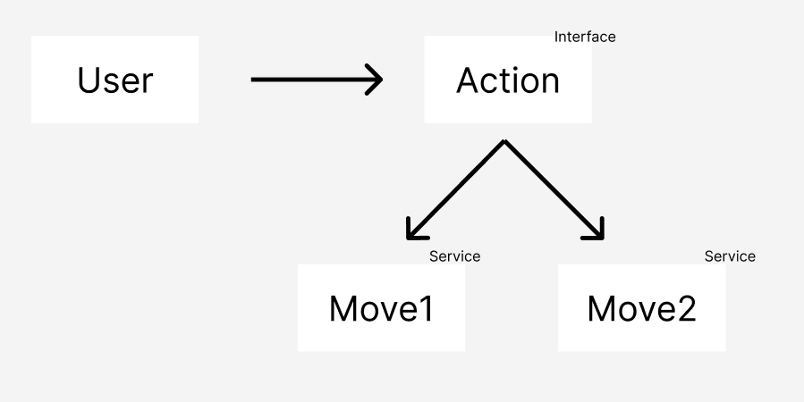

# OCP | 개방 폐쇄의 원칙 (Open Closed Principle)
>개방 폐쇄의 원칙 : 확장에 대해 열려 있어야 하고, 수정에 대해서는 닫혀 있어야 한다

> 즉, "개방 폐쇄의 원칙의 핵심은 기존 코드를 건드리지 않는다는 것입니다."

> 어떻게 기존 코드를 수정하지 않고 확장할 수 있는 거지?

OCP를 알지 못한 상태의 설계는 잘못 되어있을 가능성이 높습니다.

따라서 개방 폐쇄의 원칙을 지키기는 어렵습니다.
그러므로 코드의 __"설계"__ 부터 바꾸어야 합니다.

## 기존 설계 방식
셰프가 요리를 내어주는 과정을 통해
기존의 설계 방식이 왜 잘못되었는 지를 알아봅시다.

기존에는 셰프가 음식을 요리하여 직접 손님에게 제공하였습니다.

이런 설계라면 손님이 많을 때는 셰프가 

손님을 오래 기다리게 하겠죠..

당연히 셰프는 이를 개선하기 위해 기존의 프로세스를 변경할 것이구요.

그렇다면 OCP를 위반하게 되고 셰프도 좋은 요리가 나오기 힘들겠죠😭

## OCP 설계 방식
그래서 OCP 설계 방식에서는 모든 것을 __"역할"__ 과 __"구현"__ 으로 나눕니다.

손님의 역할은 요리를 제공 받는 것이고,

셰프의 역할은 손님에게 요리를 제공합니다.

셰프가 바꿔어도 손님의 역할은 바뀌지 않습니다.

이를 통해 손님의 역할은 변하지 않고, 음식을 제공을 받을 수 있는 것이죠.

다시말해, 셰프가 요리를 할 수만 있다면 얼마든 지 메뉴를 추가하고 수정해도 손님에게 요리를 제공할 수 있습니다.

또 다른 예시를 들어볼까요?

제가 로미오와 줄리엣의 연극을 기획하게 됐다고 가정합시다.

로미오의 역할을 최우식님이 하고 줄리엣의 역할을 김다미님으로 캐스팅했다고 가정해보겠습니다.

그런데 어느날 최우식님이 사고를 당해 연극을 못나오게 된다면 우리는 이 상황에서 어떻게 할까요?

긴급하게 로미오의 다른 남자 배우를 캐스팅할 것입니다.

로미오의 배역만 변경되었으므로 연극을 하는데에는 아무 문제가 없죠. 

즉, 로미오를 연기하는 사람만 바뀌었을 뿐 로미오의 역할은 변하지 않았습니다.

이처럼 OCP 설계를 통해 우리는 언제나 __기존 코드를 변경하지 않고도 기능을 수정하고, 추가__ 할 수 있게 됩니다.

## 왜 LSP를 지켜야할까?

위에서 얘기한 LSP를 요약하자면 다음과 같습니다.

모든 것들을 역할과 구현으로 나누고 역할은 고정된 채 구현만 새로 만들어 기능을 추가하고 수정한다.

저는 여기서 한가지 의문점이 들었습니다.
왜 굳이 모든 것을 역할과 구현으로 나누어야 할까요?

개발을 하면서 나 혼자만 코드를 보진 않죠.

결국 언젠가는 내가 아닌 다른 사람이 내 코드 보게 될 수 있을 테고
LSP를 사용하지 않는다면 유지보수 하기가 매우 어려울 것입니다.

왜냐하면 전체적인 코드의 흐름이나, 동작방식, 파일구조 등을 이해하고 있어야만이
코드를 수정할 것이고 이는 너무나 큰 자원을 소모하게 만듭니다.

따라서 이러한 자원을 줄일 수 있도록 역할과 구현을 통한 설계를 활용해야합니다.